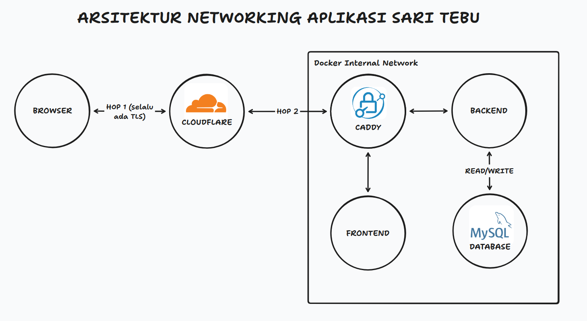

# Sari Tebu's Deployment

> [!IMPORTANT]
> Proyek ini dibuat untuk tujuan pembelajaran. Walaupun kami berusaha mengikuti industry standard, kami 
> merekomendasikan Anda untuk **tidak** menggunakan proyek ini sebagai basis production, atau
> membawakan ekspektasi berlebihan terhadap proyek ini untuk **SAAT INI**

| Git | Cloudflare | Caddy | Fedora | Digital Ocean Droplet | Docker |
|:---:|:----------:|:-----:|:------:|:---------------------:|:------:|
| <a href="https://git-scm.com/"></a> | <a href="https://cloudflare.com/"></a> | <a href="https://caddyserver.com/"></a> | <a href="https://fedoraproject.org/"></a> | <a href="https://www.digitalocean.com/"></a> | <a href="https://www.docker.com/"></a> |


 
- **Hop 1** (browser ↔ Cloudflare) selalu terenkripsi secara default, tidak perlu dikonfigurasi.
- **Hop 2** (Cloudflare ↔ origin) yang berbeda tergantung platform:
  - Di **home server**, hop ini diamankan oleh Cloudflare Tunnel (`cloudflared`) — koneksi keluar (outbound) dari server ke Cloudflare yang sudah terenkripsi secara otomatis, sehingga tidak butuh IP publik sama sekali.
  - Di **Cloud/VPS**, tidak ada tunnel yang menutupi hop ini, sehingga Caddy sendiri yang harus memegang sertifikat TLS yang valid (lihat bagian [Reverse Proxy (Caddy) Setup](#reverse-proxy-caddy-setup)).
Caddyfile, `docker-compose.yml`, dan `caddy/Dockerfile` **sama persis** di kedua platform — hanya isi `.env` dan ada/tidaknya `cloudflared` yang membedakan

## Platform-Specific Setup

### Home server (Self-Hosting)
 
Server kami saat ini merupakan komputer pribadi di Medan, Sumatera Utara dengan spesifikasi:
 
- OS: Fedora Linux 44 (Workstation Edition) x86_64
- Kernel: Linux 7.0.12-201.fc44.x86_64
- CPU: Intel(R) Core(TM) i7-2600 (8) @ 3.80 GHz
- Memory: 15.56 GiB
- Swap: 8.00 GiB
- Disk: 474.35 GiB — btrfs
Dikarenakan koneksi internet server ini adad di bawah CGNAT (tidak ada Public IP), kami menggunakan **Cloudflare Tunnel** agar Cloudflare dapat menjangkau server ini tanpa perlu membuka port apapun ke internet.
 
1. Pastikan `cloudflared` sudah terinstall dan ter-autentikasi (`cloudflared tunnel login`).
2. Tambahkan hostname baru ke DNS agar diarahkan lewat tunnel:
```sh
   cloudflared tunnel route dns <tunnel name atau tunnel ID> <domain name>
```
3. Pastikan `config.yml` milik `cloudflared` mengarahkan **semua** hostname ke Caddy (port 80), bukan langsung ke container lain — supaya semua keputusan routing tetap berada di satu tempat (Caddyfile):
```yaml
   tunnel: <tunnel-id>
   credentials-file: /home/<user>/.cloudflared/<tunnel-id>.json
   ingress:
     - hostname: api.aelberthcheong.dev
       service: http://127.0.0.1:80
     - hostname: saritebu.aelberthcheong.dev
       service: http://127.0.0.1:80
     - hostname: ssh.aelberthcheong.dev
       service: ssh://localhost:22
     - service: http_status:404
```
4. Restart service setelah perubahan apapun pada `config.yml`:
```sh
   sudo systemctl restart cloudflared
```
 
> [!WARNING]
> Tiap kali mati lampu (cukup sering di Indonesia), server akan down namun akan restart secara otomatis secepatnya. Pastikan Docker daemon di-enable saat boot (`sudo systemctl enable docker`) agar container ikut naik kembali.

### Cloud & VPS

Untuk migrasi ke penyedia dengan IP publik (contoh: DigitalOcean Droplet), langkah-langkahnya:
 
1. `git clone` repo ini ke server baru.
2. Salin `.env` yang sama persis dari home server (lihat [Reverse Proxy (Caddy) Setup](#reverse-proxy-caddy-setup)) — tidak ada yang perlu diubah di file konfigurasi manapun.
3. Arahkan DNS record `api` dan `<frontend hostname>` langsung ke IP publik droplet (A/AAAA record, proxy status **Proxied**), menggantikan record bertipe `Tunnel` yang sebelumnya dipakai di home server.
4. **`cloudflared` tidak diperlukan sama sekali** di setup ini — matikan/uninstall servicenya jika sempat ikut ter-clone.
5. Jalankan:
```sh
   docker compose up -d
```
6. Buka firewall untuk port yang dibutuhkan Caddy saja:
```sh
   sudo ufw allow 80/tcp
   sudo ufw allow 443/tcp
   sudo ufw allow 443/udp   # HTTP/3 (QUIC)
```
 
> [!WARNING]
> Karena droplet punya Public IP, port yang dibuka benar-benar bisa diakses siapa saja di internet — bukan hanya lewat Cloudflare.

## Reverse Proxy (Caddy) Setup
 
Caddy mendapatkan sertifikat TLS otomatis lewat **DNS-01 challenge** ke API Cloudflare, bukan lewat HTTP-01. Alasannya: DNS-01 tidak pernah membutuhkan koneksi masuk (inbound) ke server, sehingga cara ini bekerja identik baik di home server (di balik CGNAT) maupun di droplet (Public IP) tanpa perlu ada percabangan konfigurasi antar platform.

Pastikan .env sudah sesuai terutama CLOUDFLARE_API_TOKEN
```sh
ACME_EMAIL=your.name@example.com
CLOUDFLARE_API_TOKEN=
```

Langkah-langkah buat Cloudflare API Token:
1. Dashboard Cloudflare → profil (kanan atas) → **My Profile** → **API Tokens**
2. **Create Token** → gunakan template **"Edit zone DNS"**
3. Pastikan **Zone Resources** di-scope ke **Specific zone → domain Anda saja**, jangan "All zones"
4. **Create Token**, lalu segera salin nilainya — Cloudflare hanya menampilkannya sekali
5. Paste ke `CLOUDFLARE_API_TOKEN` di `.env.prod`

## Post Platform-Specific Setup

Buatlah cron job yang akan mengeksekusikan script `./cd.sh` tiap menit, untuk mensinkronkan HEAD pada main remote branch ke production repo.
 
```sh
crontab -e
* * * * * /home/<user>/Sari-Tebu/deployment/cd.sh # mesti berupa absolute path
```
 
Buat file ini di `/etc/logrotate.d/sari-tebu` agar log yang dihasilkan tidak menumpuk:
 
```sh
/home/<user>/Sari-Tebu/deployment.log {
    daily
    rotate 7
    compress
    missingok
    notifempty
    copytruncate
}
```
 
Set konfigurasi ini pada docker daemon di `/etc/docker/daemon.json` agar log container tidak terus bertambah memenuhi disk:
 
```json
{
  "log-driver": "json-file",
  "log-opts": {
    "max-size": "50m",
    "max-file": "5"
  }
}
```
 
Jalankan berikut untuk apply perubahan:
 
```sh
sudo systemctl restart docker
```
